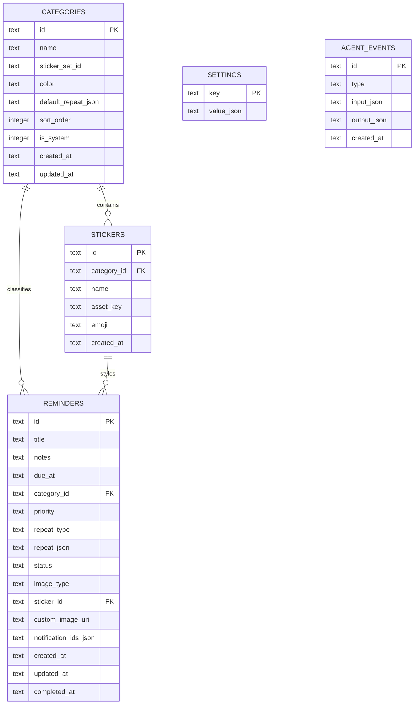

# 🔔 Remindly

> **A calm, offline-first mobile reminder and habit-tracking app powered by React Native, Expo, SQLite, and a local Agentic AI assistant.**

[](https://expo.dev/)
[](https://reactnative.dev/)
[](https://www.typescriptlang.org/)
[](https://docs.expo.dev/versions/latest/sdk/sqlite/)
[](LICENSE)

---

## 📖 Overview

**Remindly** is a cross-platform mobile assistant designed to bring calm, clarity, and consistency to daily routines. Unlike traditional cluttered reminder apps, Remindly combines a soft-tactile UI (3D depth, soft shadows, rounded geometry) with an **offline-first local architecture** and an **agentic intelligence layer** that assists users without transmitting private data to external servers.

---

## ✨ Key Features

### 📅 Smart Reminder Management
- **Full CRUD Support**: Create, view, update, snooze, complete, or archive reminders seamlessly.
- **Granular Scheduling**: Set specific dates and times, or configure flexible recurring intervals:
  - Daily, Weekly, Monthly, Yearly
  - **Custom Intervals**: Repeat every *N* minutes, hours, or days (ideal for hydration, medication, and stretch breaks).
- **Priority Levels**: Flag items with `Low`, `Medium`, or `High` urgency chips.
- **Categorization**: 10 pre-seeded categories (Work, Health & Medication, Bills & Finance, Appointments, Birthdays, Subscriptions, Vehicle & Home, Drink Water, Stretch, Travel) with custom color-coding.
- **Emoji Stickers & Photos**: Attach thematic category emoji stickers or upload custom photos from your device gallery.

### 🤖 Local Agentic AI Layer
- **Natural Language Quick Create ("Ask Agent")**:
  - Deterministic regex & keyword extraction running 100% locally on-device.
  - Zero latency, fully offline, no API key required.
  - Understands phrases like:
    - `"Remind me to drink water every 2 hours"`
    - `"Pay electricity bill tomorrow at 5pm urgent"`
    - `"Dentist appointment next monday 10am"`
- **Proactive Smart Suggestions**:
  - Analyzes active routines and suggests beneficial habits (e.g., hydration, stretch breaks).
  - Flags overdue items and provides one-tap rescheduling.
  - Suggests adding upcoming dates if categories like Birthdays & Anniversaries are empty.
- **Daily Briefing**:
  - Summarizes tasks due today, overdue items, and high-priority goals.
  - Delivers actionable daily productivity tips based on current workload.
- **Extensible LLM Provider Stub**:
  - Ready-made architectural hook (`src/services/agent/llmProvider.ts`) to plug in Gemini API or any OpenAI-compatible provider.

### 🔔 Rich Notifications & Interaction
- **Actionable Push Alerts**:
  - Snooze directly from notification drawer: `5 minutes`, `1 hour`, or `1 day`.
  - Mark as completed with a single tap.
- **Foreground Interactive Popup (`ReminderPopup`)**:
  - Soft-spring animated dialog with sticker graphic when alerts fire while the app is active.
- **Android Notification Channels**:
  - High-importance notification channel with custom vibration pattern and accent lighting.

### 🎨 Tactile Soft 3D UI & UX
- **Design Language**: Gentle neumorphic-inspired palette, elevated cards, inset form fields, and pill buttons.
- **Dual Themes**: Complete support for Light Mode, Dark Mode, or System Auto-switch.
- **Gesture-Driven Interactions**:
  - Swipe card **Right** ➡️ Mark as Done (with success haptic feedback).
  - Swipe card **Left** ⬅️ Delete reminder (with warning haptic feedback).
- **Search & Advanced Filters**:
  - Instant text search across titles and notes.
  - Multi-attribute filter chips by Category, Priority, and Completion Status.

---

## 🏗️ Architecture & Tech Stack

```
remindly/
├── app/                       # Expo Router file-based screens & navigation
│   ├── _layout.tsx            # Root layout, theme injection, app bootstrap
│   ├── (tabs)/                # Main bottom tab bar navigation
│   │   ├── _layout.tsx        # Tab bar configuration & custom central Add button
│   │   ├── index.tsx          # "Today" dashboard (Daily Brief, Ask Agent, Reminders)
│   │   ├── calendar.tsx       # "Calendar" agenda grouped by date
│   │   ├── add.tsx            # Full manual reminder creation screen
│   │   ├── categories.tsx     # Categories list & quick category view
│   │   └── settings.tsx       # User preferences, themes, and agent toggles
│   ├── reminder/
│   │   └── [id].tsx           # Edit / details modal screen
│   ├── all.tsx                # Filterable list of all reminders
│   └── search.tsx             # Real-time search screen
├── assets/                    # Icons, splash screens, and adaptive assets
├── src/
│   ├── components/            # Reusable UI widgets
│   │   ├── AgentCards.tsx     # Daily brief card & suggestion cards
│   │   ├── AppBootstrap.tsx   # DB initialization & notification listeners
│   │   ├── Chips.tsx          # Category, priority, and filter chips
│   │   ├── ReminderCard.tsx   # Swipeable reminder card with pan responder
│   │   ├── ReminderPopup.tsx  # In-app alert modal
│   │   ├── SoftButton.tsx     # Tactile styled pressable buttons
│   │   ├── SoftCard.tsx       # Elevated soft container cards
│   │   ├── StickerPicker.tsx  # Emoji & sticker selector
│   │   └── StickerView.tsx    # Sticker display container
│   ├── constants/
│   │   └── seed.ts            # Default categories, stickers, and app settings
│   ├── db/
│   │   ├── database.ts        # Expo SQLite connection, PRAGMA setup & migrations
│   │   └── repositories.ts    # Type-safe SQL CRUD queries
│   ├── services/
│   │   ├── notifications.ts   # Expo Notifications scheduling & categories
│   │   └── agent/             # Agentic AI sub-system
│   │       ├── briefingEngine.ts   # Daily workload analysis & tips
│   │       ├── localParser.ts      # Local deterministic NL query parser
│   │       ├── suggestionEngine.ts # Contextual reminder suggestions
│   │       └── llmProvider.ts      # Cloud LLM integration interface
│   ├── store/
│   │   ├── reminderStore.ts   # Zustand store for reminders, suggestions & brief
│   │   └── settingsStore.ts   # Zustand store for persistent user preferences
│   ├── theme/
│   │   ├── ThemeProvider.tsx  # Context provider for active theme
│   │   └── tokens.ts          # Color palettes, radii, spacing, elevations
│   ├── types/
│   │   └── index.ts           # Global TypeScript interfaces and domain types
│   └── utils/
│       ├── dates.ts           # Date math, recurrence computation, grouping
│       └── id.ts              # Unique ID generator
├── app.json                   # Expo application manifest & permissions
├── package.json               # Node dependencies & project scripts
└── tsconfig.json              # TypeScript configuration
```

### Core Libraries
| Category | Technology | Purpose |
|---|---|---|
| **Runtime & Framework** | React Native `0.79.2`, Expo `~53.0.9` | Mobile application engine |
| **Routing** | `expo-router` `~5.0.7` | File-system-based typed navigation |
| **Database** | `expo-sqlite` `~15.2.10` | Embedded SQLite database with WAL mode |
| **State Management** | `zustand` `^5.0.5` | Reactive global state stores |
| **Notifications** | `expo-notifications` `~0.31.2` | Local push notifications & quick actions |
| **Gestures & Animations** | `react-native-gesture-handler`, `react-native-reanimated` | Interactive gestures and transitions |
| **Haptics** | `expo-haptics` `~14.1.4` | Physical feedback on swipe actions |
| **Date Calculations** | `date-fns` `^4.1.0` | Recurrence intervals & calendar dates |
| **Icons & Media** | `@expo/vector-icons`, `expo-image-picker` | System iconography & user photo attachments |

---

## 🗄️ Database Schema

Remindly stores all user data in a local SQLite file (`remindly.db`) with Foreign Keys enabled and Write-Ahead Logging (`WAL`) mode:



---

## 🚀 Getting Started

### Prerequisites
- [Node.js](https://nodejs.org/) (v18 or LTS recommended)
- [npm](https://www.npmjs.com/) or [yarn](https://yarnpkg.com/)
- [Expo Go](https://expo.dev/go) app installed on your physical iOS or Android device, **or** Android Studio / Xcode for simulators.

### Installation

1. **Clone or navigate to the repository**:
   ```bash
   cd ~/Projects/remindly
   ```

2. **Install project dependencies**:
   ```bash
   npm install
   ```

   > **Note**: If dependency conflicts arise across Expo SDK versions, run:
   > ```bash
   > npx expo install --fix
   > ```

3. **Start the Expo development server**:
   ```bash
   npx expo start
   ```

4. **Launch the app**:
   - **Physical Device**: Scan the terminal QR code using **Expo Go** (Android) or the native Camera app (iOS).
   - **Android Emulator**: Press `a` in the terminal.
   - **iOS Simulator**: Press `i` in the terminal (macOS required).
   - **Web Preview**: Press `w` in the terminal.

---

## 📱 Platform & Permissions Setup

Remindly's `app.json` includes preconfigured permissions for notification handling and image selection:

### Android
- `POST_NOTIFICATIONS`: Prompts user for notification delivery permission (Android 13+).
- `SCHEDULE_EXACT_ALARM`: Required for time-sensitive scheduled reminder notifications.
- `RECEIVE_BOOT_COMPLETED`: Reschedules active alarms when the device reboots.
- `VIBRATE`: Provides haptic feedback and alarm vibration patterns.

### iOS
- `UIBackgroundModes`: Configured for `remote-notification` support.
- `NSPhotoLibraryUsageDescription`: Enables attaching gallery photos to reminders.

---

## 🛠️ Available Scripts

| Command | Action |
|---|---|
| `npm start` | Launches the Expo Metro bundler |
| `npm run android` | Starts Metro bundler and opens the app on a connected Android device/emulator |
| `npm run ios` | Starts Metro bundler and opens the app on iOS Simulator |
| `npm run web` | Serves the web-compatible version in your browser |
| `npm run lint` | Runs ESLint checks across TypeScript files |

---

## 🗺️ Roadmap & Recommended Next Steps

1. **Native Date & Time Picker**:
   - Replace the current manual text inputs (`yyyy-MM-dd` / `HH:mm`) in `add.tsx` and `[id].tsx` with `@react-native-community/datetimepicker` for smooth scroll/calendar interaction.
2. **Cloud LLM Integration**:
   - Wire `src/services/agent/llmProvider.ts` to Google Gemini API (`@google/genai`) or an external endpoint to handle complex conversational schedules.
3. **Data Backup & Export**:
   - Add SQLite database JSON export / import in Settings to let users back up their reminders.
4. **Custom Sound Packs**:
   - Provide custom gentle chime sounds via a prebuilt development build (`npx expo run:android` / `npx expo run:ios`).

---

## 📄 License

This project is licensed under the [MIT License](LICENSE).
